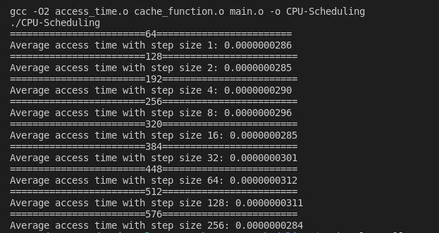
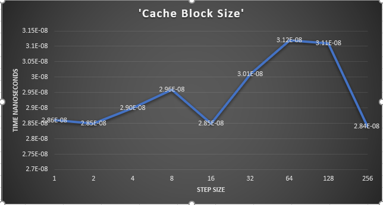

# **CPU-Scheduling - Ashanti Long & Cormac Conahan**

## **1. How Big is a Cache Block?**
### Thought Process:
The first thing we wanted to do is understand what a cache block is. From our research we detirmined that a cache block is described as a basic unit for cache storage. It typically contain multiple bytes/words of data. This is due to many different regions of memory being mapped into a block, the tag is used to differentiate between them. A typical machine has a cache block of 32bytes. Knowing this information we came up with two approach  to implement.

#### Approach 1:
Fill a plain array with random values, and do something simple, e.g. square each element in a loop. Then measure the execution time as a function of the array length. You'll very clearly see a jump in the exec time once your array does not fit into the cache.
#### Approach 2:

Preallocate a large array. Then access each element sequentially and record the time for each access. Ideally there will be a jump in access time when cache miss occurs. Then you can calculate your L1 Cache. It might not work but worth trying

#### Actual Approach:

For our approach we are taking an array of integers and we are looping through it and acessing indexes using step variables which are the number of elements we skip and then it increases at by (^ 2). So for each interation we  theroized thatas we go to each iteriation  using the step eventually the cache block size should cause a spike in the index acess time because eventually we would need to call another cache block. As you look below at *Figure 1* below you will see a spike from 16KB to 32KB

### Our Code

### Output and Graph 

### Interpretation 
We saw the spike start at 32 bytes and it peak at 64 bytes so we decided to experiment with block sizes of 32 bytes and 64 bytes 

## **2. How Big is the Cache?**

## **3. How Long Does a Reference to Main Memory Take?**
### Thought Process:

During our research we discovered that a typical modern  processors typically have a clock cycle of 0.5ns while accesses to main memory are 50ns or more. Thus, an access to main memory is very expensive, over 100 clock cycles. To get good processor performance the average times to fetch instructions and to access data from memory must be reduced.Basically, as the list grows you'll see the performance worsen in steps as another layer of caching is overwhelmed. The idea is simple... if the cache holds the last N units of memory you've accessed, then looping around a buffer of even N+1 units should ensure constant cache misses. (There're more details/caveats in the "measuring latencies of memory" answer you link to in your question). We should be able to get some idea of the potential size of the the largest cache that might front your RAM from hardware documentation - as long as you operate on more memory than that you should be measuring physical RAM times.

## **4. How Long Does a Reference that can be Satisfied from Cache Take?**
